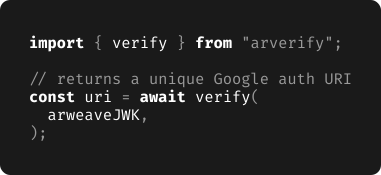

# Pretty code in READMEs
Credits for this goes to [@johnletey](https://github.com/johnletey).

The image is from [ArVerify README](https://github.com/ArVerify/arverify-js/blob/6f85cad3b80a8b1c14a336a5c861f8f5b0d2813f/README.md).

